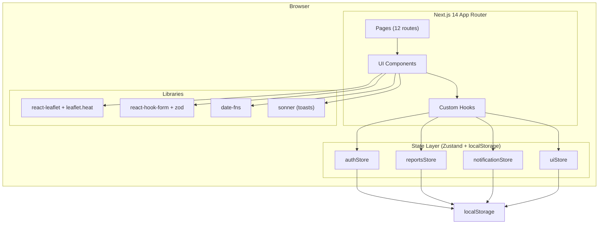
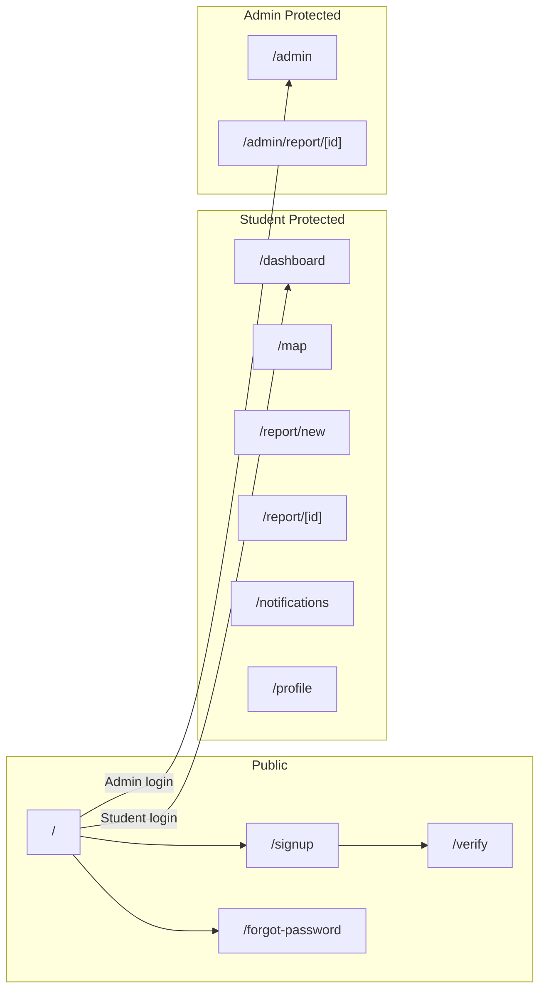
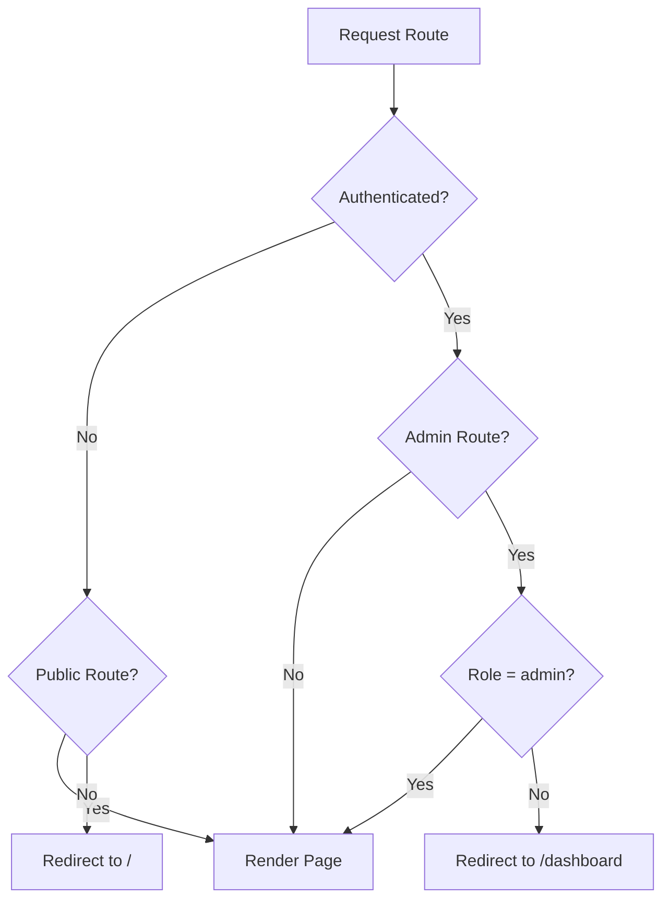

# Design Document — SafeCampus

## Overview

SafeCampus is a fully client-side campus safety and issue-reporting web application for California State University, Fullerton (CSUF). It enables verified students to submit categorized safety/maintenance reports with photos and map locations, browse a community-driven feed sorted by upvotes, visualize issue density on an interactive heat map, and receive notifications on report resolutions. Administrators triage and resolve reports through a dedicated dashboard. All data is mocked in a TypeScript seed file and persisted via Zustand stores backed by localStorage.

### Key Design Decisions

1. **No backend / no database** — All state lives in Zustand stores with `persist` middleware writing to localStorage. This keeps the demo self-contained and deployable as a static Next.js export.
2. **Mock authentication** — Login, signup, OTP, and password reset are simulated entirely in-memory. OTP accepts any 7-digit numeric string. Passwords are stored as plain hashes (demo only).
3. **react-leaflet + leaflet.heat** — Chosen over Google Maps to avoid API keys. OpenStreetMap tiles are free and sufficient for a campus-scale map.
4. **shadcn/ui** — Provides accessible, composable primitives (Button, Card, Dialog, Input, Badge, Tabs, Select, Textarea, Avatar, Switch) that integrate natively with Tailwind CSS.
5. **Zustand over Context API** — Zustand offers simpler boilerplate, built-in persist middleware, and better performance for cross-component state sharing.
6. **react-hook-form + zod** — Provides schema-first validation with type inference, enabling compile-time safety and runtime validation from a single source of truth.

## Architecture

### High-Level Architecture



### Routing Architecture



### Access Control Flow



## Components and Interfaces

### Directory Structure

```
/app
  layout.tsx                  # Root layout with Inter font, Toaster, DemoBanner
  page.tsx                    # / (Login)
  /signup/page.tsx
  /verify/page.tsx
  /forgot-password/page.tsx
  /dashboard/page.tsx
  /map/page.tsx
  /report/new/page.tsx
  /report/[id]/page.tsx
  /notifications/page.tsx
  /profile/page.tsx
  /admin/page.tsx
  /admin/report/[id]/page.tsx
/components
  /ui                         # shadcn/ui primitives (Button, Card, Dialog, etc.)
  AuthGuard.tsx               # Route protection HOC
  DemoBanner.tsx              # Dismissible demo mode banner
  ReportCard.tsx              # Report summary card for feed
  SeverityBadge.tsx           # Color-coded severity indicator
  CategoryBadge.tsx           # Category label badge
  StatusBadge.tsx             # Status label badge
  UpvoteButton.tsx            # Upvote with self-upvote prevention
  PhotoUploader.tsx           # Max 3 JPG/PNG photo attachment
  LocationPicker.tsx          # Leaflet-based location selector
  HeatMap.tsx                 # Heat map with severity gradient
  ReportDetailModal.tsx       # Full report detail overlay
  NotificationBell.tsx        # Nav bell with unread count badge
  AnonymousToggle.tsx         # Privacy toggle for report submission
  OtpInput.tsx                # 7-digit OTP entry component
  StepperForm.tsx             # 7-step report submission wizard
  NotificationItem.tsx        # Single notification row
  AdminReportTable.tsx        # Admin report list table
  SkeletonLoader.tsx          # Loading placeholder component
/lib
  types.ts                    # All TypeScript interfaces and type aliases
  mockData.ts                 # Seed data (users, reports, notifications)
  schemas.ts                  # Zod validation schemas
  constants.ts                # Design tokens, map coords, config
  utils.ts                    # Helpers (severity→color, relative time, etc.)
  /store
    authStore.ts
    reportsStore.ts
    notificationStore.ts
    uiStore.ts
```

### Key Component Interfaces

#### AuthGuard

```typescript
interface AuthGuardProps {
  children: React.ReactNode;
  requiredRole?: "student" | "admin";
}
```

Wraps protected pages. Reads `currentUser` from `authStore`. Redirects unauthenticated users to `/`. Redirects students away from admin routes to `/dashboard`. Allows admins to access student routes.

#### ReportCard

```typescript
interface ReportCardProps {
  report: Report;
  currentUserId: string;
  onUpvote: (reportId: string) => void;
}
```

Renders title, CategoryBadge, SeverityBadge, StatusBadge, upvote count, relative time, and author name (or "Anonymous"). Disables upvote button when `authorId === currentUserId`.

#### StepperForm

```typescript
interface StepperFormProps {
  onSubmit: (data: ReportFormData) => void;
}

type ReportFormData = {
  title: string;
  description: string;
  category: ReportCategory;
  severity: Severity;
  location: { lat: number; lng: number; areaName: string };
  photos: Photo[];
  isAnonymous: boolean;
};
```

7-step wizard: (1) Title & Description, (2) Category, (3) Severity, (4) Location, (5) Photos, (6) Privacy, (7) Review & Submit. Each step validates via zod before allowing progression.

#### HeatMap

```typescript
interface HeatMapProps {
  reports: Report[];
  filters: { category?: ReportCategory; severity?: Severity };
  onReportClick: (reportId: string) => void;
}
```

Renders react-leaflet `MapContainer` centered on CSUF (33.8823, -117.8851). Converts reports to heat points with intensity mapped from severity: Low=0.25, Medium=0.5, High=0.75, Critical=1.0. Applies 5-minute delay for anonymous reports. Color gradient: green→yellow→orange→red.

#### PhotoUploader

```typescript
interface PhotoUploaderProps {
  photos: Photo[];
  onAdd: (photo: Photo) => void;
  onRemove: (photoId: string) => void;
  maxPhotos: 3;
}
```

Accepts only `image/jpeg` and `image/png`. Converts files to dataUrl via FileReader. Enforces max 3 photos.

#### NotificationBell

```typescript
interface NotificationBellProps {
  unreadCount: number;
  onClick: () => void;
}
```

Displays bell icon (lucide-react) with a red badge showing `unreadCount` when > 0. Navigates to `/notifications` on click.

#### OtpInput

```typescript
interface OtpInputProps {
  length: 7;
  onComplete: (code: string) => void;
  error?: string;
}
```

Renders 7 individual digit input boxes. Auto-focuses next box on input. Calls `onComplete` when all 7 digits are entered.

## Data Models

All types defined in `/lib/types.ts`:

```typescript
// Enums / Union Types
type UserRole = "student" | "admin";
type ReportCategory = "Safety" | "Maintenance" | "Harassment" | "Lost & Found" | "Other";
type ReportStatus = "Open" | "In Progress" | "Resolved";
type Severity = "Low" | "Medium" | "High" | "Critical";
type NotifType = "report_resolved" | "new_report" | "urgent_alert" | "status_change";
type Urgency = "urgent" | "non_urgent";

// Core Interfaces
interface User {
  id: string;
  name: string;
  email: string;                    // must end with @csu.fullerton.edu
  passwordHash: string;
  role: UserRole;
  avatar: string;                   // URL or placeholder
  isVerified: boolean;
  mfaEnabled: boolean;
  failedLoginAttempts: number;
  lockedUntil: string | null;       // ISO timestamp or null
  notificationPrefs: NotificationPrefs;
  language: "en" | "es";
  publicProfile: boolean;
  locationPermission: boolean;
  createdAt: string;                // ISO timestamp
}

interface NotificationPrefs {
  emailEnabled: boolean;
  inAppEnabled: boolean;
  categories: {
    safety: boolean;
    maintenance: boolean;
    harassment: boolean;
    lostAndFound: boolean;
    other: boolean;
  };
}

interface Report {
  id: string;
  title: string;
  description: string;
  category: ReportCategory;
  severity: Severity;
  status: ReportStatus;
  location: {
    lat: number;
    lng: number;
    areaName: string;
  };
  photos: Photo[];
  isAnonymous: boolean;
  authorId: string;
  upvotedBy: string[];              // array of userIds
  submittedAt: string;              // ISO timestamp
  resolvedAt: string | null;
  resolvedBy: string | null;
  resolutionNotes: string | null;
}

interface Photo {
  id: string;
  url: string;                      // dataUrl or picsum URL
  fileType: "image/jpeg" | "image/png";
  uploadedAt: string;               // ISO timestamp
}

interface Notification {
  id: string;
  userId: string;
  type: NotifType;
  urgency: Urgency;
  category: string;
  header: string;
  body: string;
  read: boolean;
  sentAt: string;                   // ISO timestamp
  reportId?: string;                // optional link to related report
}
```

### Zustand Store Interfaces

```typescript
// authStore
interface AuthState {
  currentUser: User | null;
  users: User[];
  login: (email: string, password: string) => { success: boolean; error?: string };
  logout: () => void;
  signup: (name: string, email: string, password: string) => { success: boolean; error?: string };
  verifyOTP: (code: string) => boolean;
  resetPassword: (email: string, otp: string, newPassword: string) => { success: boolean; error?: string };
  toggleMFA: () => void;
  updateProfile: (updates: Partial<User>) => void;
  updateNotifPrefs: (prefs: Partial<NotificationPrefs>) => void;
}

// reportsStore
interface ReportsState {
  reports: Report[];
  addReport: (data: Omit<Report, "id" | "status" | "submittedAt" | "upvotedBy" | "resolvedAt" | "resolvedBy" | "resolutionNotes">) => Report;
  upvoteReport: (reportId: string, userId: string) => { success: boolean; error?: string };
  removeUpvote: (reportId: string, userId: string) => void;
  markResolved: (reportId: string, adminId: string, notes: string) => void;
  getByCategory: (category: ReportCategory) => Report[];
  getSortedByUpvotes: () => Report[];
}

// notificationStore
interface NotificationState {
  notifications: Notification[];
  push: (notification: Omit<Notification, "id" | "sentAt" | "read">) => void;
  markRead: (notificationId: string) => void;
  markAllRead: (userId: string) => void;
  unreadCount: (userId: string) => number;
}

// uiStore
interface UIState {
  mapFilters: { category?: ReportCategory; severity?: Severity };
  feedFilter: ReportCategory | null;
  activeModal: string | null;
  demoBannerDismissed: boolean;
  setMapFilters: (filters: Partial<UIState["mapFilters"]>) => void;
  setFeedFilter: (category: ReportCategory | null) => void;
  setActiveModal: (modalId: string | null) => void;
  dismissDemoBanner: () => void;
}
```

### Zod Validation Schemas (in `/lib/schemas.ts`)

```typescript
import { z } from "zod";

const csuEmailSchema = z.string().email().refine(
  (email) => email.endsWith("@csu.fullerton.edu"),
  { message: "Only CSUF emails are allowed" }
);

const passwordSchema = z.string()
  .min(8, "Password must be at least 8 characters and include a symbol")
  .refine((pw) => /[^a-zA-Z0-9]/.test(pw), {
    message: "Password must be at least 8 characters and include a symbol",
  });

const otpSchema = z.string().regex(/^\d{7}$/, "Invalid verification code.");

const reportFormSchema = z.object({
  title: z.string().min(1, "Title is required"),
  description: z.string().min(1, "Description is required"),
  category: z.enum(["Safety", "Maintenance", "Harassment", "Lost & Found", "Other"]),
  severity: z.enum(["Low", "Medium", "High", "Critical"]),
  location: z.object({
    lat: z.number(),
    lng: z.number(),
    areaName: z.string().min(1, "Location is required"),
  }),
  photos: z.array(z.object({
    id: z.string(),
    url: z.string(),
    fileType: z.enum(["image/jpeg", "image/png"]),
    uploadedAt: z.string(),
  })).max(3, "Maximum 3 photos per report"),
  isAnonymous: z.boolean(),
});

const signupSchema = z.object({
  name: z.string().min(1, "Name is required"),
  email: csuEmailSchema,
  password: passwordSchema,
});

const loginSchema = z.object({
  email: z.string().email("Valid email is required").min(1, "Email is required"),
  password: z.string().min(1, "Password is required"),
});

const resetPasswordSchema = z.object({
  password: passwordSchema,
  confirmPassword: z.string(),
}).refine((data) => data.password === data.confirmPassword, {
  message: "Passwords do not match",
  path: ["confirmPassword"],
});
```

### Severity-to-Heat Mapping

| Severity | Heat Intensity | Gradient Color | Tailwind Class |
|----------|---------------|----------------|----------------|
| Low      | 0.25          | Green (#16A34A) | `text-safe`    |
| Medium   | 0.5           | Yellow (#EAB308)| `text-caution` |
| High     | 0.75          | Orange (#F59E0B)| `text-warning` |
| Critical | 1.0           | Red (#DC2626)   | `text-danger`  |

## Correctness Properties

*A property is a characteristic or behavior that should hold true across all valid executions of a system — essentially, a formal statement about what the system should do. Properties serve as the bridge between human-readable specifications and machine-verifiable correctness guarantees.*

### Property 1: CSUF Email Validation

*For any* string, the CSUF email validation schema SHALL accept it if and only if it is a well-formed email address ending in "@csu.fullerton.edu". All other strings SHALL be rejected with the message "Only CSUF emails are allowed".

**Validates: Requirements 1.2**

### Property 2: Password Strength Validation

*For any* string, the password validation schema SHALL accept it if and only if it is at least 8 characters long and contains at least one symbol (non-alphanumeric character). All other strings SHALL be rejected with the appropriate error message.

**Validates: Requirements 1.4**

### Property 3: Required Field Validation Across All Forms

*For any* form schema (signup, login, report submission) and *for any* input object where one or more required fields are empty or missing, the zod schema SHALL return a failure result listing exactly the missing/empty fields. Conversely, *for any* input where all required fields are validly populated, the schema SHALL return a success result.

**Validates: Requirements 1.5, 2.4, 5.3, 20.4**

### Property 4: Successful Login Sets Session

*For any* registered user (student or admin) with valid credentials and a non-locked account, calling login with the correct email and password SHALL set `currentUser` in the Auth_Store to that user. The user's role SHALL determine the redirect target: "student" → /dashboard, "admin" → /admin.

**Validates: Requirements 2.1, 2.2**

### Property 5: Failed Login Increments Counter Without Granting Access

*For any* registered user and *for any* incorrect password, calling login SHALL increment `failedLoginAttempts` by 1 on the user record and SHALL NOT set `currentUser` in the Auth_Store.

**Validates: Requirements 2.3**

### Property 6: Account Lockout After Three Failed Attempts

*For any* user, after exactly 3 consecutive failed login attempts, the user's `lockedUntil` SHALL be set to a timestamp approximately 15 minutes in the future. While `lockedUntil` is in the future, *for any* login attempt (even with correct credentials), the Auth_Store SHALL reject the attempt and SHALL NOT set `currentUser`.

**Validates: Requirements 2.5, 2.6**

### Property 7: OTP Validation Accepts Only 7-Digit Numeric Strings

*For any* string, the OTP validation schema SHALL accept it if and only if it matches the pattern `/^\d{7}$/` (exactly 7 numeric digits). All other strings SHALL be rejected with "Invalid verification code."

**Validates: Requirements 3.2, 3.3, 4.5**

### Property 8: Duplicate Signup Prevention

*For any* email already present in the Auth_Store users array, calling signup with that email SHALL return a failure with "An account with this email already exists" and SHALL NOT add a new user to the array.

**Validates: Requirements 1.3**

### Property 9: Report Creation Defaults

*For any* valid report form data (title, description, category, severity, location, photos, isAnonymous), calling `addReport` SHALL create a Report with `status` equal to "Open", `upvotedBy` as an empty array, `submittedAt` set to a valid ISO timestamp, and `resolvedAt`, `resolvedBy`, `resolutionNotes` all set to null.

**Validates: Requirements 5.2**

### Property 10: Photo Type Validation

*For any* file type string, the photo validation SHALL accept it if and only if it equals "image/jpeg" or "image/png". All other file types SHALL be rejected with "Only JPG and PNG files are accepted".

**Validates: Requirements 5.4, 5.6**

### Property 11: Anonymous Report Author Concealment

*For any* Report with `isAnonymous` set to true, the display name returned by the author-display function SHALL be "Anonymous" regardless of the actual `authorId`.

**Validates: Requirements 5.5, 7.3**

### Property 12: Anonymous Report Location Delay on Heat Map

*For any* Report with `isAnonymous` set to true and `submittedAt` less than 5 minutes before the current time, the heat map data filter SHALL exclude that report's location. *For any* anonymous report with `submittedAt` 5 or more minutes before the current time, the location SHALL be included.

**Validates: Requirements 5.8**

### Property 13: Report Feed Sorting — Upvotes Descending with Time Tiebreaker

*For any* array of non-resolved reports, `getSortedByUpvotes` SHALL return them ordered by `upvotedBy.length` in descending order. *For any* two reports with equal `upvotedBy.length`, the one with the more recent `submittedAt` SHALL appear first.

**Validates: Requirements 6.1, 6.2**

### Property 14: Category Filter Returns Only Matching Reports

*For any* array of reports and *for any* selected `ReportCategory`, `getByCategory` SHALL return only reports whose `category` field equals the selected category. The returned array SHALL be a subset of the input array.

**Validates: Requirements 6.3, 9.5**

### Property 15: Upvote Idempotence and Self-Upvote Prevention

*For any* user and *for any* report: (a) if the user's `userId` is NOT in `upvotedBy` and `userId` ≠ `authorId`, calling `upvoteReport` SHALL add `userId` to `upvotedBy` exactly once; (b) if the user's `userId` is already in `upvotedBy`, calling `upvoteReport` SHALL NOT modify the array; (c) if `userId` equals `authorId`, calling `upvoteReport` SHALL NOT modify the array.

**Validates: Requirements 8.1, 8.2, 8.5**

### Property 16: Report Resolution Updates All Required Fields

*For any* report with status "Open" or "In Progress" and *for any* non-empty resolution notes string, calling `markResolved` SHALL set `status` to "Resolved", `resolvedAt` to a valid ISO timestamp, `resolvedBy` to the admin's userId, and `resolutionNotes` to the provided string. A notification of type "report_resolved" SHALL be pushed to the Notification_Store for the report's `authorId`.

**Validates: Requirements 11.2**

### Property 17: Notification Sorting by Sent Time

*For any* array of notifications belonging to a user, the notifications page SHALL display them sorted by `sentAt` in descending order (most recent first).

**Validates: Requirements 12.3**

### Property 18: Mark All Read Sets All Notifications to Read

*For any* user and *for any* array of notifications belonging to that user (with any mix of read/unread states), calling `markAllRead` SHALL set `read` to true for every notification belonging to that user. Notifications belonging to other users SHALL remain unchanged.

**Validates: Requirements 12.5**

### Property 19: Notification Preferences Persistence

*For any* valid `NotificationPrefs` object, calling `updateNotifPrefs` SHALL persist the new preferences to the Auth_Store such that reading back the current user's `notificationPrefs` produces an object equivalent to the one provided.

**Validates: Requirements 13.2**

### Property 20: MFA Toggle Inverts State

*For any* user, calling `toggleMFA` SHALL set `mfaEnabled` to the logical negation of its current value. Calling `toggleMFA` twice SHALL restore the original value (involution property).

**Validates: Requirements 13.3**

### Property 21: Category and Severity Enum Validation

*For any* string, the report category zod schema SHALL accept it if and only if it is one of "Safety", "Maintenance", "Harassment", "Lost & Found", or "Other". Similarly, the severity schema SHALL accept it if and only if it is one of "Low", "Medium", "High", or "Critical".

**Validates: Requirements 14.2, 14.3**

### Property 22: Report JSON Serialization Round-Trip

*For any* valid Report object, `JSON.parse(JSON.stringify(report))` SHALL produce an object deeply equal to the original report.

**Validates: Requirements 14.4, 16.5**

### Property 23: LocalStorage Persistence Does Not Overwrite Existing Data

*For any* pre-existing data in localStorage for a Zustand store key, initializing the store SHALL load the persisted data and SHALL NOT overwrite it with mock seed data.

**Validates: Requirements 15.5**

### Property 24: Unauthenticated Access Redirect

*For any* protected route (any route other than /, /signup, /verify, /forgot-password) and *for any* unauthenticated state (currentUser is null), the AuthGuard SHALL redirect to the / (login) route.

**Validates: Requirements 18.2**

### Property 25: Admin Route Access Control

*For any* user with role "student", attempting to access /admin or /admin/report/[id] SHALL result in a redirect to /dashboard. *For any* user with role "admin", access SHALL be granted.

**Validates: Requirements 10.6, 18.3**

## Error Handling

### Form Validation Errors

| Context | Error Condition | User-Facing Message | Behavior |
|---------|----------------|---------------------|----------|
| Signup | Non-CSUF email | "Only CSUF emails are allowed" | Inline error below email field |
| Signup | Duplicate email | "An account with this email already exists" | Inline error below email field |
| Signup | Weak password | "Password must be at least 8 characters and include a symbol" | Inline error below password field |
| Signup/Login | Empty required field | Field-specific validation message | Inline error below each empty field |
| Login | Wrong credentials | "Invalid email or password" | Inline error, failedLoginAttempts++ |
| Login | Account locked | "Account locked. Try again in 15 minutes." | Inline error with remaining time |
| OTP | Invalid code | "Invalid verification code." | Inline error below OTP input |
| Report | Missing required field | Step-specific validation message | Inline error on relevant step, block progression |
| Report | Invalid photo type | "Only JPG and PNG files are accepted" | Toast notification via sonner |
| Report | Too many photos | "Maximum 3 photos per report" | Toast notification, upload button disabled |
| Admin Resolve | Empty resolution notes | "Resolution notes are required" | Inline error below textarea |
| Password Reset | Empty email | "Email is required" | Inline error below email field |

### Navigation Errors

| Context | Error Condition | Behavior |
|---------|----------------|----------|
| Report Detail | Non-existent reportId | Display "Report not found" with link to dashboard |
| Upvote | Report no longer exists | Toast: "This report is no longer available" |
| Upvote | Already upvoted | Toast: "You have already upvoted this report" |
| Protected Route | Not authenticated | Redirect to / |
| Admin Route | Student role | Redirect to /dashboard |

### State Errors

| Context | Error Condition | Behavior |
|---------|----------------|----------|
| localStorage | Corrupted data | Fall back to mock seed data, log warning to console |
| Store rehydration | Missing keys | Merge with defaults, preserve existing valid data |
| Photo upload | FileReader failure | Toast: "Failed to process image. Please try again." |

## Testing Strategy

### Unit Tests (Example-Based)

Unit tests cover specific scenarios, edge cases, UI rendering, and integration points:

- **Auth flows**: Login redirect by role, MFA redirect to /verify, OTP page rendering, password reset flow steps
- **Seed data**: Verify exact counts (4 students, 1 admin, 10 reports, 6 notifications, correct status distribution)
- **UI components**: ReportCard renders all required fields, DemoBanner dismissal persists in session, skeleton loaders appear during loading, severity/category/status badges render correct colors
- **Heat map**: Map centers on CSUF coordinates, severity-to-intensity mapping (Low=0.25, Medium=0.5, High=0.75, Critical=1.0), urgency-to-icon mapping (urgent=⚠, non_urgent=🔔)
- **Edge cases**: Non-existent report ID shows "Report not found", upvote on deleted report shows error, max 3 photos enforcement, empty filter results show placeholder
- **Sound**: report_resolved notification triggers audio playback
- **Demo mode**: Reset Demo Data reloads all stores with original mock data

### Property-Based Tests (fast-check)

Property-based tests use [fast-check](https://github.com/dubzzz/fast-check) to verify universal properties across randomly generated inputs. Each test runs a minimum of 100 iterations.

| Property | Test Description | Tag |
|----------|-----------------|-----|
| 1 | Generate random strings, verify CSUF email schema accepts iff ends with @csu.fullerton.edu | Feature: safe-campus, Property 1: CSUF Email Validation |
| 2 | Generate random strings, verify password schema accepts iff ≥8 chars with symbol | Feature: safe-campus, Property 2: Password Strength Validation |
| 3 | Generate form inputs with random missing fields, verify schema rejects with correct field list | Feature: safe-campus, Property 3: Required Field Validation |
| 4 | Generate valid user credentials, verify login sets currentUser | Feature: safe-campus, Property 4: Successful Login Sets Session |
| 5 | Generate wrong passwords for existing users, verify counter increments | Feature: safe-campus, Property 5: Failed Login Increments Counter |
| 6 | Generate users, fail 3 times, verify lockout; attempt login while locked, verify rejection | Feature: safe-campus, Property 6: Account Lockout |
| 7 | Generate random strings, verify OTP schema accepts iff exactly 7 numeric digits | Feature: safe-campus, Property 7: OTP Validation |
| 8 | Generate existing users, attempt re-signup, verify rejection | Feature: safe-campus, Property 8: Duplicate Signup Prevention |
| 9 | Generate valid report data, call addReport, verify defaults | Feature: safe-campus, Property 9: Report Creation Defaults |
| 10 | Generate random MIME type strings, verify only jpeg/png accepted | Feature: safe-campus, Property 10: Photo Type Validation |
| 11 | Generate anonymous reports, verify display name is "Anonymous" | Feature: safe-campus, Property 11: Anonymous Author Concealment |
| 12 | Generate anonymous reports with various timestamps, verify 5-min delay filter | Feature: safe-campus, Property 12: Anonymous Location Delay |
| 13 | Generate report arrays with random upvote counts and timestamps, verify sort order | Feature: safe-campus, Property 13: Report Feed Sorting |
| 14 | Generate report arrays and random category, verify filter correctness | Feature: safe-campus, Property 14: Category Filter |
| 15 | Generate user/report combos, verify upvote idempotence and self-upvote prevention | Feature: safe-campus, Property 15: Upvote Idempotence |
| 16 | Generate reports and resolution notes, verify all fields updated and notification pushed | Feature: safe-campus, Property 16: Report Resolution |
| 17 | Generate notification arrays, verify sorted by sentAt DESC | Feature: safe-campus, Property 17: Notification Sorting |
| 18 | Generate mixed read/unread notifications, call markAllRead, verify all read | Feature: safe-campus, Property 18: Mark All Read |
| 19 | Generate random NotificationPrefs, update and read back, verify equivalence | Feature: safe-campus, Property 19: Notification Prefs Persistence |
| 20 | Generate users with random mfaEnabled, toggle twice, verify original restored | Feature: safe-campus, Property 20: MFA Toggle Involution |
| 21 | Generate random strings, verify category/severity enum schemas | Feature: safe-campus, Property 21: Enum Validation |
| 22 | Generate valid Report objects, JSON round-trip, verify deep equality | Feature: safe-campus, Property 22: Report JSON Round-Trip |
| 23 | Pre-populate localStorage, initialize store, verify persisted data preserved | Feature: safe-campus, Property 23: LocalStorage Persistence |
| 24 | Generate unauthenticated state + protected routes, verify redirect to / | Feature: safe-campus, Property 24: Unauthenticated Redirect |
| 25 | Generate student users + admin routes, verify redirect to /dashboard | Feature: safe-campus, Property 25: Admin Route Access Control |

### Test Configuration

- **Framework**: Jest or Vitest (compatible with Next.js 14)
- **PBT Library**: fast-check
- **Minimum iterations**: 100 per property test
- **Coverage targets**: All Zustand store methods, all zod schemas, all utility functions
- **Mocking**: No external services to mock — all state is in-memory via Zustand

